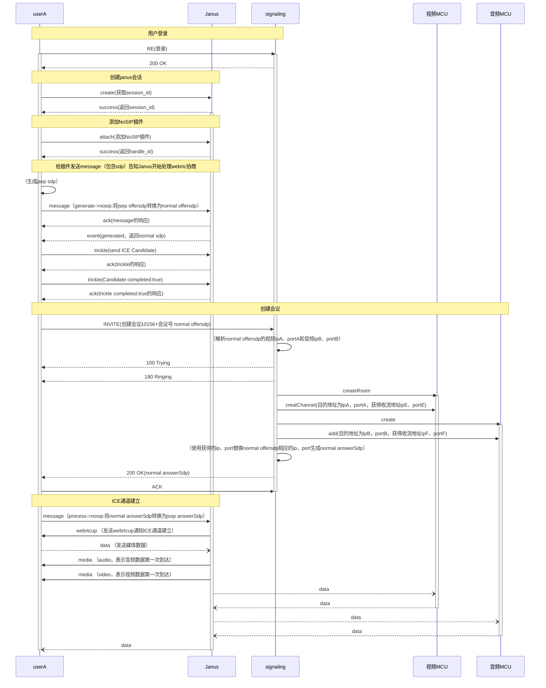

## NoSIP会议流程梳理

- 连接交互流程

## 概述

- 通过RTC终端实现基于webrtc/Janus的多人音视频通话

- 支持麦克风、摄像头切换/开关，屏幕共享，系统音频采集，摄像头画面镜像能力

- 依赖webrtc，Janus（nosip），theia7（信令服务器、音视频MCU服务器）

## 形态

- 通过xxx-xxx（例如：111-222）作为会议号
- 在会议中可以分别开启麦克风和摄像头
- 在会议中可以打开屏幕共享和系统音频共享，系统音频共享应该基于屏幕共享开启后开启

## 方案

- 终端发送会议号，由信令服务器确认会议是否存在，并将终端加入会议
- 终端控制麦克风和摄像头设备时，业务消息转发给信令服务器，由信令转发给各MCU，媒体能力由webrtc支持
- 终端集成视频引擎、音频引擎、连接引擎，分别实现音视频控制和Janus交互能力

## 流程

### 创建/加入会议

- `终端`向`Janus`发起创建会话请求，得到sessionId
- `终端`向`Janus`发起注册插件请求，得到handleId
- `终端`开始初始化pc，生成JSEP offer
- `终端`向`Janus`发起generate请求，得到传统 offer
- `终端`向`Janus`发起trickle请求，告知`Janus`终端ICE候选
- `终端`向`信令服务器`发起INVITE请求，告知会议号，得到传统 answer
- `终端`向`信令服务器`发起ACK响应
- `终端`向`Janus`发起process请求，得到JSEP answer
- `终端`完成pc协商，媒体流建立

### 设备控制

- `终端`修改pc，实现摄像头/麦克风控制
- `终端`向`信令服务器`发起info请求

### 媒体控制

- `终端`向`信令服务器`发起info请求，判断是否能够开启屏幕共享
- `终端`根据信令回复修改pc，实现屏幕共享、系统音频共享

### 结束会议

- `终端`向`信令服务器`发起bye请求
- `终端`关闭pc
