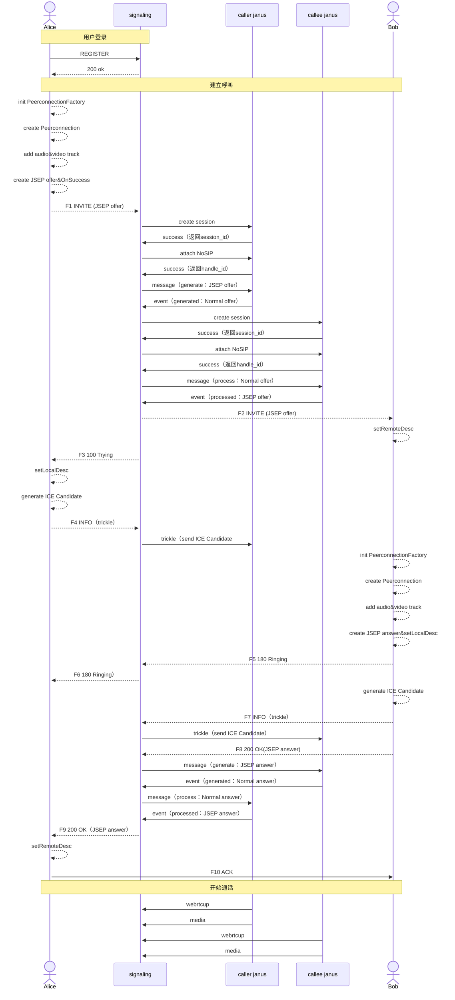

## SIP 1v1时序图

#### 注意： F7/F8（200 OK）没有必然顺序

```mermaid
sequenceDiagram
  actor Alice
  participant signaling
  participant caller janus
  participant callee janus
  actor Bob
  Note over Alice,signaling: 用户登录
  Alice->>signaling: REGISTER
  activate Alice
  activate signaling
  signaling-->>Alice: 200 ok
  
  Note over Alice,Bob: 建立呼叫
  Alice-->>Alice: init PeerconnectionFactory
  Alice-->>Alice: create Peerconnection
  Alice-->>Alice: add audio&video track
  Alice-->>Alice: create JSEP offer&OnSuccess
  Alice-->>signaling: F1 INVITE (JSEP offer)
  signaling->>caller janus: create session
  caller janus->>signaling: success（返回session_id）
  signaling->>caller janus: attach NoSIP
  caller janus->>signaling: success（返回handle_id）
  
  signaling->>caller janus: message（generate：JSEP offer）
  caller janus->>signaling: event（generated：Normal offer）
  signaling->>callee janus: create session
  callee janus->>signaling: success（返回session_id）
  signaling->>callee janus: attach NoSIP
  callee janus->>signaling: success（返回handle_id）
  signaling->>callee janus: message（process：Normal offer）
  callee janus->>signaling: event（processed：JSEP offer）
  signaling-->>Bob: F2 INVITE (JSEP offer)
  Bob-->>Bob: setRemoteDesc
  signaling-->>Alice: F3 100 Trying
  Alice-->>Alice: setLocalDesc
  Alice-->>Alice: generate ICE Candidate
  Alice-->>signaling: F4 INFO（trickle）
  signaling->>caller janus: trickle（send ICE Candidate

  Bob-->>Bob: init PeerconnectionFactory
  Bob-->>Bob: create Peerconnection
  Bob-->>Bob: add audio&video track
  Bob-->>Bob: create JSEP answer&setLocalDesc
  Bob-->>signaling: F5 180 Ringing 
  signaling-->>Alice: F6 180 Ringing）
  
  Bob-->>Bob: generate ICE Candidate
  Bob-->>signaling: F7 INFO（trickle）
  signaling->>callee janus: trickle（send ICE Candidate）
  
  
  Bob-->>signaling: F8 200 OK(JSEP answer)
  signaling->>callee janus: message（generate：JSEP answer）
  callee janus->>signaling: event（generated：Normal answer）
  signaling->>caller janus: message（process：Normal answer）
  caller janus->>signaling: event（processed：JSEP answer）
  signaling-->>Alice: F9 200 OK（JSEP answer）
  Alice-->>Alice: setRemoteDesc
  Alice->>Bob: F10 ACK
  
  Note over Alice,Bob: 开始通话
  caller janus->>signaling: webrtcup
  caller janus->>signaling: media
  callee janus->>signaling: webrtcup
  callee janus->>signaling: media
  
```

