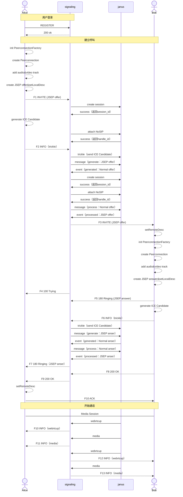

# SIP 1v1时序图

> Since @Ambert 2025年3月31日
>
> 基于sip协议实现信令交互；
>
> 基于Janus-nosip插件实现rtp中继；

```mermaid
sequenceDiagram
  actor Alice
  participant signaling
  participant janus
  actor Bob
  Note over Alice,signaling: 用户登录
  Alice->>signaling: REGISTER
  activate Alice
  activate signaling
  signaling-->>Alice: 200 ok
  
  Note over Alice,Bob: 建立呼叫
  Alice-->>Alice: init PeerconnectionFactory
  Alice-->>Alice: create Peerconnection
  Alice-->>Alice: add audio&video track
  Alice-->>Alice: create JSEP offer&setLocalDesc
  Alice-->>signaling: F1 INVITE (JSEP offer)
  signaling->>janus: create session
  janus->>signaling: success（返回session_id）
  Alice-->>Alice: generate ICE Candidate
  signaling->>janus: attach NoSIP
  janus->>signaling: success（返回handle_id）
  Alice-->>signaling: F2 INFO（trickle）
  signaling->>janus: trickle（send ICE Candidate）
  signaling->>janus: message（generate：JSEP offer）
  janus->>signaling: event（generated：Normal offer）
  signaling->>janus: create session
  janus->>signaling: success（返回session_id）
  signaling->>janus: attach NoSIP
  janus->>signaling: success（返回handle_id）
  signaling->>janus: message（process：Normal offer）
  janus->>signaling: event（processed：JSEP offer）
  signaling-->>Bob: F3 INVITE (JSEP offer)
  Bob-->>Bob: setRemoteDesc
  Bob-->>Bob: init PeerconnectionFactory
  Bob-->>Bob: create Peerconnection
  Bob-->>Bob: add audio&video track
  Bob-->>Bob: create JSEP answer&setLocalDesc
  signaling-->>Alice: F4 100 Trying
  Bob-->>signaling: F5 180 Ringing (JSEP answer)
  Bob-->>Bob: generate ICE Candidate
  Bob-->>signaling: F6 INFO（trickle）
  signaling->>janus: trickle（send ICE Candidate）
  signaling->>janus: message（generate：JSEP anser）
  janus->>signaling: event（generated：Normal anser）
  signaling->>janus: message（process：Normal anser）
  janus->>signaling: event（processed：JSEP anser）
  signaling-->>Alice: F7 180 Ringing（JSEP anser）
  Bob-->>signaling: F8 200 OK
  signaling-->>Alice: F9 200 OK
  Alice-->>Alice: setRemoteDesc
  Alice->>Bob: F10 ACK
  
  Note over Alice,Bob: 开始通话
  Alice->Bob: Media Session
  janus->>signaling: webrtcup
  signaling-->>Alice: F10 INFO（webrtcup）
  janus->>signaling: media
  signaling-->>Alice: F11 INFO（media）
  janus->>signaling: webrtcup
  signaling-->>Bob: F12 INFO（webrtcup）
  janus->>signaling: media
  signaling-->>Bob: F13 INFO（media）
  
```

