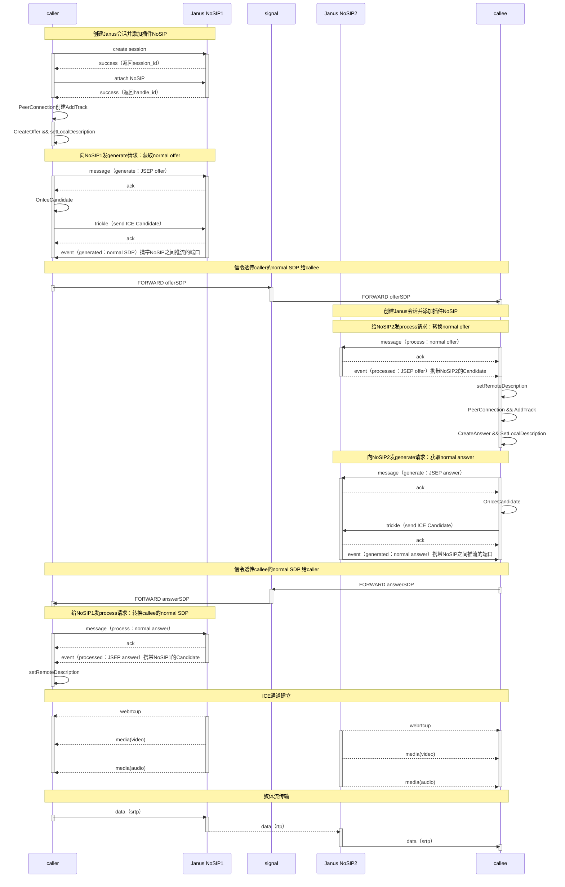

## 1V1 协商流程

```mermaid
sequenceDiagram
	participant caller
	participant Janus NoSIP1
	participant signal
	participant Janus NoSIP2
	participant callee
  
  Note over caller,Janus NoSIP1: 创建Janus会话并添加插件NoSIP
  caller->>Janus NoSIP1: create session
  activate caller
  activate Janus NoSIP1
  Janus NoSIP1-->>caller: success（返回session_id）
  caller->>Janus NoSIP1: attach NoSIP
  Janus NoSIP1-->>caller: success（返回handle_id）
  deactivate caller
  deactivate Janus NoSIP1

  caller->>caller: PeerConnection创建AddTrack 
  activate caller
  caller->>caller: CreateOffer && setLocalDescription
  deactivate caller
  
  Note over caller,Janus NoSIP1: 向NoSIP1发generate请求：获取normal offer
  caller->>Janus NoSIP1: message（generate：JSEP offer）
  activate caller
  activate Janus NoSIP1
  Janus NoSIP1-->>caller: ack
  caller->>caller: OnIceCandidate
  caller->>Janus NoSIP1: trickle（send ICE Candidate）
  Janus NoSIP1-->>caller: ack
  Janus NoSIP1->>caller: event（generated：normal SDP）携带NoSIP之间推流的端口
  deactivate caller
  deactivate Janus NoSIP1
  
  Note over caller,callee: 信令透传caller的normal SDP 给callee
  caller->>signal: FORWARD offerSDP
  activate caller
  activate signal
  deactivate caller
  signal->>callee: FORWARD offerSDP
  activate callee
  deactivate signal
  deactivate callee
  
  Note over callee,Janus NoSIP2: 创建Janus会话并添加插件NoSIP
  Note over callee,Janus NoSIP2: 给NoSIP2发process请求：转换normal offer
  callee->>Janus NoSIP2: message（process：normal offer）
  activate callee
  activate Janus NoSIP2
  Janus NoSIP2-->>callee: ack
  Janus NoSIP2-->>callee: event（processed：JSEP offer）携带NoSIP2的Candidate
  deactivate callee
  deactivate Janus NoSIP2

  activate callee
  callee->>callee: setRemoteDescription
  callee->>callee: PeerConnection && AddTrack
  callee->>callee: CreateAnswer && SetLocalDescription
  deactivate callee
  
  Note over callee,Janus NoSIP2: 向NoSIP2发generate请求：获取normal answer
  callee->>Janus NoSIP2: message（generate：JSEP answer）
  activate callee
  activate Janus NoSIP2
  Janus NoSIP2-->>callee: ack
  callee->>callee: OnIceCandidate
  callee->>Janus NoSIP2: trickle（send ICE Candidate）
  Janus NoSIP2-->>callee: ack
  Janus NoSIP2->>callee: event（generated：normal answer）携带NoSIP之间推流的端口
  deactivate callee
  deactivate Janus NoSIP2

  Note over caller,callee: 信令透传callee的normal SDP 给caller
  callee->>signal: FORWARD answerSDP
  activate callee
  activate signal
  deactivate callee
  signal->>caller: FORWARD answerSDP
  activate caller
  deactivate signal
  deactivate caller
    
  Note over caller,Janus NoSIP1: 给NoSIP1发process请求：转换callee的normal SDP
  caller->>Janus NoSIP1: message（process：normal answer）
  activate caller
  activate Janus NoSIP1
  Janus NoSIP1-->>caller: ack
  Janus NoSIP1-->>caller: event（processed：JSEP answer）携带NoSIP1的Candidate
  deactivate Janus NoSIP1
  caller->>caller: setRemoteDescription
  deactivate caller
  
  Note over caller,callee: ICE通道建立
  Janus NoSIP1-->>caller: webrtcup
  activate caller
  activate Janus NoSIP1
  Janus NoSIP2-->>callee: webrtcup
  activate Janus NoSIP2
  activate callee
  Janus NoSIP1-->>caller: media(video)
  Janus NoSIP2-->>callee: media(video)
  Janus NoSIP1-->>caller: media(audio)
  deactivate caller
  deactivate Janus NoSIP1
  Janus NoSIP2-->>callee: media(audio)
  deactivate callee
  deactivate Janus NoSIP2
  
  Note over caller,callee: 媒体流传输
  caller->>Janus NoSIP1: data（srtp）
  activate caller
  activate Janus NoSIP1
  deactivate caller
  Janus NoSIP1-->>Janus NoSIP2: data（rtp）
  activate Janus NoSIP2
  deactivate Janus NoSIP1
  Janus NoSIP2->>callee: data（srtp）
  activate callee
  deactivate callee
  deactivate Janus NoSIP2
```