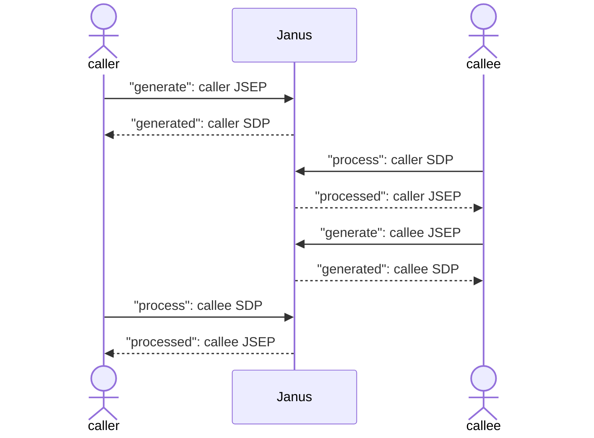
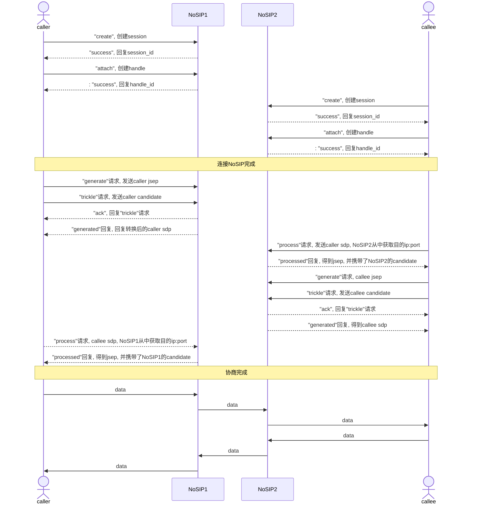

# NoSIP Demo 流程梳理

- 创建 caller/callee 对象
- 随机创建用户id

### 1.  Janus.init

- 初始化 Janus 库及相关环境

### 2. new Janus

- 初始化相关配置

- 调用 `createSession()` 创建会话

  - 通过具体地址与 Janus 建立一个新的连接 `ws`

  - 创建会话响应处理

    ```
    - error
          - 连接出现错误
        - 存在多个server地址, 且当前不为重连操作, 尝试下一个服务器
        - 所有服务器均失败, 调用error报错
        - 如果不是重连操作, 等待200ms后尝试再次连接	
    - open
        - ws连接成功
        - 更新 'connected' 状态为true
        - 将会话id存储到Janus.sessions中
        - 回调 success
        - 调用ws.send发送创建会话请求
        - request
        { 
            "janus": "create",            // 方法
            "transaction": "MisbcYpjpmF1",         // 请求标识
        }
        - response
        { 
            "janus" : "success", 
            "transaction" : "MisbcYpjpmF1", 
            "data" : { 
                "id" : 4655833144425402            // 会话标识seeion_id
            } 
        }
    
    - message
        - 当ws接收到消息, 则会调用该函数
        - 将接收到的json格式解析并传递至	'handleEvent'	
    - clsoe
        - 关闭ws连接
        - 更新 'connected' 转台为false, 并报告连接丢失错误
    ```


- ##### `handleEvent()`

  - Janus 服务器响应信息处理

    ```
    - keepalive
        - 输出一条调试信息, 用于活跃连接
    - server_info
        - 获取transaction, 回调对相应请求做出回应
    - ack
        - 获取transaction, 回调对相应请求做出回应
    - success
        - 获取transaction, 回调对相应请求做出回应
    - trickle
        - 提取`sender`字段
        - 通过 sneder 找到对应的 pluginHandle
        - 获取 pluginHandle.webrtcStuff
        - 添加 candidate
    - webrtcup
        - 调用 webrtcState(true) 通知webRTC连接已建立
    - hangup
        - webrtcState(false, json["reason"]),  传入false和挂断原因通知webRTC连接即将被关闭
    - detached
        - 执行会话分离操作
    - media
        - 通知媒体流状态变化
    - slowlink
        - 通知检测到上行/下行丢包
    - error
        - 通知错误信息
    - event
        - 提取 json 中的 jsep
        - 回调 onmessage
    - timeout
        - 会话超时, 待用close关闭websoclet连接
    ```


### 3. janus.attach (主叫)

- 调用 `createHandle()`

- ##### `createHandle`

  - 初始化回调函数

  - 检查连接状态

  - 检查提供的插件是否有效

  - 构建attach请求

  - request

    ```json
    {
        "janus": "attach",                                       // 请求方法
        "plugin": "janus.plugin.nosip",                          // 插件名称
        "opaque_id": "nosiptest-caller-ek65zFoQjFOV",            // 会话唯一标识
        "session_id": 4655833144425402,
        "transaction": "NH6AWvhIgERV"
    }
    ```

  - response

    ```json
    {
        "janus": "success", 
        "session_id": 4655833144425402, 
        "transaction": "NH6AWvhIgERV",
        "data":{
            "id": 4398654254762904       // handle_id
        }
    }
    ```


- 定义一个 pluginHandle 对象, 该对象封装了与 Janus NoSIP 交互所需的方法和变量

- 创建成功后回调 `success(pluginHandle)`

- 将获取的 pluginHandle 对象命名为 `caller`

#### 3.1. success

- `caller.createOffer`

  - 调用`prepareWebrtc`

  - ##### `prepareWebrtc`

    - 创建一个PeerConnection
    - 调用 `captureDevices()` 管理媒体轨道的生命周期, 包括添加/替换/移除音视频流
    - 调用 `createOffer()` : 调用`RTCPeerConnection`的`createOffer()`获取一个包含SDP信息的offer对象
    - 回调 success(offer)


##### 3.1.1. caller.send

- 发送 generate 请求至 Janus服务器(JSEP-->SDP)

  - request

    ```json
    caller-->Janus
    {
        "janus":"message",
        "body":{
            "request":"generate"
        },
        "transaction":"1HHN8Hq0Wofg",
        "jsep":{
            "type":"offer",
            "sdp":"v=0\r\no=- 2768947241026398118 2 IN IP4 127.0.0.1\r\ns=-\r\nt=0 0\r\na=group:BUNDLE 0 1\r\na=extmap-allow-mixed\r\na=msid-semantic: WMS 46b638c1-b070-4304-a32a-27d4d63900fa\r\nm=audio 9 UDP/TLS/RTP/SAVPF 111 63 9 0 8 13 110 126\r\nc=IN IP4 0.0.0.0\r\na=rtcp:9 IN IP4 0.0.0.0\r\na=ice-ufrag:P6+O\r\na=ice-pwd:hR9sW7PlHMfLdm32pyDhVVln\r\na=ice-options:trickle\r\na=fingerprint:sha-256 D0:A2:88:88:03:34:0A:A7:61:EB:B0:B3:98:72:D7:AF:0F:5B:FE:DA:76:27:B5:46:C2:36:8A:C0:35:AD:E2:67\r\na=setup:actpass\r\na=mid:0\r\na=extmap:1 urn:ietf:params:rtp-hdrext:ssrc-audio-level\r\na=extmap:2..."
        },
        "session_id":4655833144425402,
        "handle_id":4398654254762904
    }
    ```

  - response

    ```json
    Janus-->caller
    {
       "janus": "event",
       "session_id": 4655833144425402,
       "transaction": "1HHN8Hq0Wofg",
       "sender": 4398654254762904,
       "plugindata": {
          "plugin": "janus.plugin.nosip",
          "data": {
             "nosip": "event",
             "result": {
                "event": "generated",
                "type": "offer",
                "sdp": "v=0\r\no=- 2768947241026398118 2 IN IP4 1.1.1.1\r\ns=-\r\nt=0 0\r\nm=audio 20032 RTP/AVP 111 63 9 0 8 13 110 126\r\nc=IN IP4 10.1.29.246\r\na=sendrecv\r\na=mid:0\r\na=extmap:1 urn:ietf:params:rtp-hdrext:ssrc-audio-level\r\na=extmap:2..."
             }
          }
       }
    }
    ```

- 异步发送"trickle"请求: 发送本地candidate候选

  - request

  ```json
  {
      "janus":"trickle",
      "candidate":{
          "candidate":"candidate:2243614435 1 udp 2122260223 26.26.26.1 51078 typ host generation 0 ufrag Nxmt network-id 1 network-cost 50",
          "sdpMid":"0",
          "sdpMLineIndex":0
      },
      "transaction":"6sFwKDXcMD6P",
      "session_id":4655833144425402,
      "handle_id":4398654254762904
  }
  ```

  - response

  ```json
  {
     "janus": "ack",
     "session_id": 4655833144425402,
     "transaction": "6sFwKDXcMD6P"
  }
  ```

#### 3.2. onmessage

- 接收到 Janus 服务器的消息为 `json["janus"] === "event"`

- 回调 `pluginHandle.onmessage`

##### "generated"事件

- 获取转换后的 sdp(本地)

- 将caller的本地sdp信息打包成一个process(SDP->JSEP)请求, 由callee发送给服务器

  - request

    ```json
    callee-->Janus
    {
        "janus":"message",
        "body":{
            "request":"process",
            "type":"offer",
            "sdp":"v=0\r\no=- 2768947241026398118 2 IN IP4 1.1.1.1\r\ns=-\r\nt=0 0\r\nm=audio 20032 RTP/AVP 111 63 9 0 8 13 110 126\r\nc=IN IP4 10.1.29.246\r\na=sendrecv\r\na=mid:0\r\na=extmap:1 urn:ietf:params:rtp-hdrext:ssrc-audio-level\r\na=extmap:2..."
        },
        "transaction":"DQ4RJhqWieYH",
        "session_id":4655833144425402,
        "handle_id":788545001570383
    }
    ```

    - response

      ```json
      Janus-->callee
      {
         "janus": "event",
         "session_id": 4655833144425402,
         "transaction": "DQ4RJhqWieYH",
         "sender": 788545001570383,
         "plugindata": {
            "plugin": "janus.plugin.nosip",
            "data": {
               "nosip": "event",
               "result": {
                  "event": "processed"
               }
            }
         },
         "jsep": {
            "type": "offer",
            "sdp": "v=0\r\no=- 2768947241026398118 2 IN IP4 10.1.29.246\r\ns=-\r\nt=0 0\r\na=group:BUNDLE 0 1\r\na=ice-options:trickle\r\na=fingerprint:sha-256 D2:29:65:DA:4E:59:D6:01:EC:10:4F:82:14:1F:35:9B:D2:FA:AD:6F:C1:48:AD:BF:FD:5A:8B:86:E3:10:0B:C7\r\na=extmap-allow-mixed\r\na=msid-semantic: WMS *\r\nm=audio 9 UDP/TLS/RTP/SAVPF 111 63 9 0 8 13 110 126\r\nc=IN IP4 10.1.29.246\r\na=sendrecv\r\na=mid:0\r\na=rtcp-mux\r\na=ice-ufrag:giCc\r\na=ice-pwd:fvuQkbFbvKVqkUJB8G+3tq\r\na=ice-options:trickle\r\na=setup:actpass\r\na=extmap:1 urn:ietf:params:rtp-hdrext:ssrc-audio-level\r\na=extmap:2..."
         }
      }
      ```

##### "processed"

- 在callee的"generated"事件中, 由caller发送了"process"请求至服务器
- 接收到相应的"processed"事件
- 调用 `caller.handleRemoteJsep` --> `prepareWebrtcPeer`
- 根据"processed"事件中的 jsep 设置远端信息及远端sdp

### 3. janus.attach (被叫)

- 调用 `createHandle()`

- ##### `createHandle`

  - 初始化回调函数

  - 检查连接状态

  - 检查提供的插件是否有效

  - 构建attach请求

  - request

    ```json
    {
        "janus": "attach",                       // 请求方法
        "plugin": "janus.plugin.nosip",          // 插件名称
        "session_id": 123456,                    // 会话唯一标识
        "loop_index": loopIndex, 
        "transaction": "abc",                    // 请求标识
        "token": ???,                            // 非必选
        "apisecret": ???                         // 非必选
    }
    ```

  - response

    ```json
    { 
        “janus” ："success",
        "session_id" : 123456,
        “transaction” ："abc",           // 与请求相同
        “data” ：{ 
            “id” ：987654                // pluginHandle唯一标识id
        } 
    }
    ```


- 定义一个 pluginHandle 对象, 该对象封装了与 Janus NoSIP 交互所需的方法和变量

- 创建成功后回调 `success(pluginHandle)`

#### 3.1 success

- 将获取的 pluginHandle 对象命名为 `callee`

#### 3.2 onmessage

##### "processed"

- 主叫收到 "generated" 事件后, 对callee发送了'"process"请求

- callee 收到 "peocessed" 事件后, 调用 `callee.createAnswer` --> `prepareWebrtc`

- `prepareWebrtc`

  - 根据 "peocessed" 事件返回的 `jsep` 设置远端描述信息及远端sdp

  - 设置 iceCandidate

  - 调用 `captureDevices()` 管理媒体轨道的生命周期, 包括添加/替换/移除音视频流

  - 调用 `createAnswer()` : 调用`RTCPeerConnection`的`createAnswer()`获取一个包含SDP信息的answer对象

  - 发送"generate"请求至服务器转换answer(jsep)

    - request

      ```json
      callee-->Janus
      {
          "janus":"message",
          "body":{
              "request":"generate"
          },
          "transaction":"Y2h08E8xzGvX",
          "jsep":{
              "type":"answer",
              "sdp":"v=0\r\no=- 3008942393122099415 2 IN IP4 127.0.0.1\r\ns=-\r\nt=0 0\r\na=group:BUNDLE 0 1\r\na=extmap-allow-mixed\r\na=msid-semantic: WMS cf53b02d-e905-4746-8420-4be681e92962\r\nm=audio 9 UDP/TLS/RTP/SAVPF 111 63 9 0 8 13 110 126\r\nc=IN IP4 0.0.0.0\r\na=rtcp:9 IN IP4 0.0.0.0\r\na=ice-ufrag:Sqpn\r\na=ice-pwd:nb2+Q5PDn+JEMCQvc2eWgkJf\r\na=ice-options:trickle\r\na=fingerprint:sha-256 87:2B:87:FE:5C:28:0F:72:19:A0:19:4D:BB:4F:D7:65:23:B1:D8:35:DF:EA:4F:C9:B8:83:03:02:AD:FF:64:1D\r\na=setup:active\r\na=mid:0\r\na=extmap:1 urn:ietf:params:rtp-hdrext:ssrc-audio-level\r\na=extmap:2..."
          },
          "session_id":4655833144425402,
          "handle_id":788545001570383
      }
      ```

    - response

      ```json
      Janus-->callee
      {
         "janus": "event",
         "session_id": 4655833144425402,
         "transaction": "Y2h08E8xzGvX",
         "sender": 788545001570383,
         "plugindata": {
            "plugin": "janus.plugin.nosip",
            "data": {
               "nosip": "event",
               "result": {
                  "event": "generated",
                  "type": "answer",
                  "sdp": "v=0\r\no=- 3008942393122099415 2 IN IP4 1.1.1.1\r\ns=-\r\nt=0 0\r\nm=audio 20036 RTP/AVP 111 63 9 0 8 13 110 126\r\nc=IN IP4 10.1.29.246\r\na=sendrecv\r\na=mid:0\r\na=extmap:1 urn:ietf:params:rtp-hdrext:ssrc-audio-level\r\na=extmap:2..."
               }
            }
         }
      }
      ```

##### "generated"

- 接收到"generated"事件

- 保存本地sdp信息

- 将callee相应信息打包成"process"请求, 由caller发送至服务器

  - request

    ```json
    caller-->Janus
    {
        "janus":"message",
        "body":{
            "request":"process",
            "type":"answer",
            "sdp":"v=0\r\no=- 3008942393122099415 2 IN IP4 1.1.1.1\r\ns=-\r\nt=0 0\r\nm=audio 20036 RTP/AVP 111 63 9 0 8 13 110 126\r\nc=IN IP4 10.1.29.246\r\na=sendrecv\r\na=mid:0\r\na=extmap:1 urn:ietf:params:rtp-hdrext:ssrc-audio-level\r\na=extmap:2 http://www.webrtc.org/experiments/rtp-hdrext/abs-send-time\r\na=extmap:3 ..."
        },
        "transaction":"5iA2Wvo0vPa6",
        "session_id":4655833144425402,
        "handle_id":4398654254762904
    }
    ```

  - response

    ```json
    Janus-->caller
    {
       "janus": "event",
       "session_id": 4655833144425402,
       "transaction": "5iA2Wvo0vPa6",
       "sender": 4398654254762904,
       "plugindata": {
          "plugin": "janus.plugin.nosip",
          "data": {
             "nosip": "event",
             "result": {
                "event": "processed"
             }
          }
       },
       "jsep": {
          "type": "answer",
          "sdp": "v=0\r\no=- 3008942393122099415 2 IN IP4 10.1.29.246\r\ns=-\r\nt=0 0\r\na=group:BUNDLE 0 1\r\na=ice-options:trickle\r\na=fingerprint:sha-256 D2:29:65:DA:4E:59:D6:01:EC:10:4F:82:14:1F:35:9B:D2:FA:AD:6F:C1:48:AD:BF:FD:5A:8B:86:E3:10:0B:C7\r\na=extmap-allow-mixed\r\na=msid-semantic: WMS *\r\nm=audio 9 UDP/TLS/RTP/SAVPF 111 63 9 0 8 13 110 126\r\nc=IN IP4 10.1.29.246\r\na=sendrecv\r\na=mid:0\r\na=rtcp-mux\r\na=ice-ufrag:AnZQ\r\na=ice-pwd:oXrbvP3Q6o6R18GXvVf8m8\r\na=ice-options:trickle\r\na=setup:active\r\na=mid:0\r\na=extmap:1 urn:ietf:params:rtp-hdrext:ssrc-audio-level\r\na=extmap:2 ..."
       }
    }
    ```

- 异步发送"trickle"请求: 发送本地candidate候选

  - request

  ```json
  {
      "janus":"trickle",
      "candidate":{
          "candidate":"candidate:2243614435 1 udp 2122260223 26.26.26.1 51078 typ host generation 0 ufrag Nxmt network-id 1 network-cost 50",
          "sdpMid":"0",
          "sdpMLineIndex":0
      },
      "transaction":"6sFwKDXcMD6P",
      "session_id":4655833144425402,
      "handle_id":788545001570383
  }
  ```

  - response

  ```json
  {
     "janus": "ack",
     "session_id": 4655833144425402,
     "transaction": "6sFwKDXcMD6P"
  }
  ```


#### 3.3 attach 其他响应

- consentDialog
  - 处理用户是否同意对话框的显示
  - `on = true`: 提示用户允许浏览器访问摄像头和麦克风
  - `on = false`: 隐藏提示信息
- iceState
  - 在ICE发生变化时被调用
  - 使用`Janus.log`记录 ICE状态的变化
- mediaState
  - 媒体状态发生变化时被调用
  - 使用`Janus.log`记录 媒体流`started/stopped`, `媒体流类型`, `媒体流id`
- webrtcState
  - Peerconnection状态发生变化时被调用
  - on: 通话开始, 启用视频切换按钮
  - 使用`Janus.log`记录 Peerconnection状态 `up/down`
- slowLink
  - 网络连接出现问题时被调用(丢包)
  - 使用`Janus.log`记录 `上行/下行`, `媒体流id`, `丢失数据包数量`
- onlocaltrack
  - 管理本地媒体轨道的添加和移除
  - 处理ICE连接状态
- onremotetrack
  - 管理远程媒体轨道的添加和移除
- oncleanup
  - 在结束通话或需要清理当前会话时被调用
  - 清理所有资源, 包括音视频轨道及UI元素
  - 重置会话状态


## NoSIP SDP交互流程图




## NoSIP demo 交互流程图



