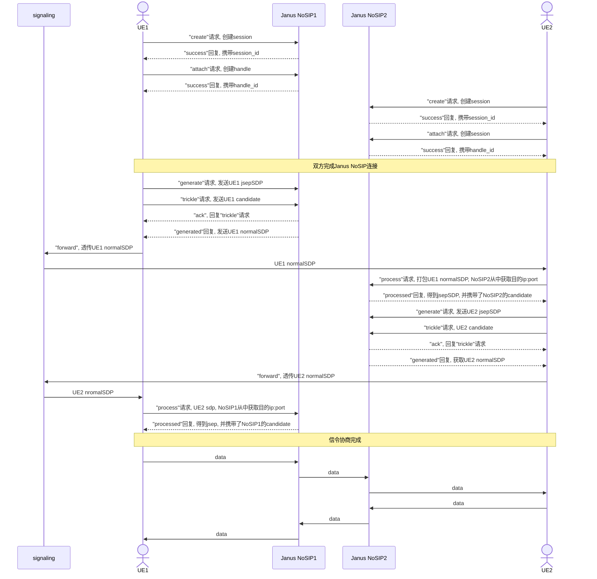

## 基于 Janus NoSIP 1v1 连接与协商方案

### 流程图

- 说明: `normalSDP`为传统对等端能够解析的sdp格式

```mermaid
sequenceDiagram
	participant signaling
	actor UE1	
	participant Janus NoSIP1
	participant Janus NoSIP2	
	actor UE2


UE1->>Janus NoSIP1: "create"请求, 创建session
Janus NoSIP1-->>UE1: "success"回复, 携带session_id
UE1->>Janus NoSIP1: "attach"请求, 创建handle
Janus NoSIP1-->>UE1: "success"回复, 携带handle_id

UE2->>Janus NoSIP2: "create"请求, 创建session
Janus NoSIP2-->>UE2: "success"回复, 携带session_id
UE2->>Janus NoSIP2: "attach"请求, 创建session
Janus NoSIP2-->>UE2: "success"回复, 携带handle_id

Note over UE1,UE2: 双方完成Janus NoSIP连接

UE1->>Janus NoSIP1: "generate"请求, 发送UE1 jsepSDP
UE1->>Janus NoSIP1: "trickle"请求, 发送UE1 candidate
Janus NoSIP1-->>UE1: "ack", 回复"trickle"请求
Janus NoSIP1-->>UE1: "generated"回复, 发送UE1 normalSDP
UE1->>signaling: "forward", 透传UE1 normalSDP
signaling->>UE2: UE1 normalSDP

UE2->>Janus NoSIP2: "process"请求, 打包UE1 normalSDP, NoSIP2从中获取目的ip:port
Janus NoSIP2-->>UE2: "processed"回复, 得到jsepSDP, 并携带了NoSIP2的candidate
UE2->>Janus NoSIP2: "generate"请求, 发送UE2 jsepSDP
UE2->>Janus NoSIP2: "trickle"请求, UE2 candidate
Janus NoSIP2-->>UE2: "ack", 回复"trickle"请求
Janus NoSIP2-->>UE2: "generated"回复, 获取UE2 normalSDP

UE2->>signaling: "forward", 透传UE2 normalSDP
signaling->>UE1: UE2 nromalSDP
UE1->>Janus NoSIP1: "process"请求, UE2 sdp, NoSIP1从中获取目的ip:port
Janus NoSIP1-->>UE1: "processed"回复, 得到jsep, 并携带了NoSIP1的candidate

Note over UE1,UE2: 信令协商完成
UE1->>Janus NoSIP1: data
Janus NoSIP1->>Janus NoSIP2: data
Janus NoSIP2->>UE2: data

UE2->>Janus NoSIP2: data
Janus NoSIP2->>Janus NoSIP1: data
Janus NoSIP1->>UE1: data
```