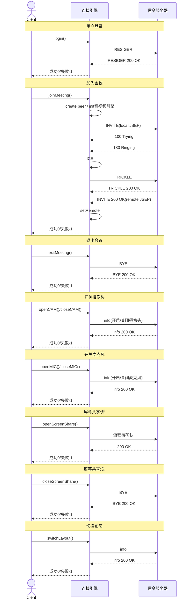

## 连接引擎2.0时序图

```mermaid
sequenceDiagram
    actor client
	participant 连接引擎
  	participant 信令服务器
  	
  Note over client,信令服务器: 用户登录
  client->>连接引擎: login()
  连接引擎->>信令服务器: RESIGER
  信令服务器-->>连接引擎: RESIGER 200 OK
  连接引擎-->>client: 成功0/失败-1
  
  Note over client,信令服务器: 加入会议
  client->>连接引擎: joinMeeting()
  连接引擎->>连接引擎: create peer / init音视频引擎
  连接引擎->>信令服务器: INVITE(local JSEP)
  
  信令服务器-->>连接引擎: 100 Trying
  
  信令服务器-->>连接引擎: 180 Ringing
  
  连接引擎->>连接引擎: ICE
  连接引擎->>信令服务器: TRICKLE
  信令服务器-->>连接引擎: TRICKLE 200 OK
  
  信令服务器-->>连接引擎: INVITE 200 OK(remote JSEP)
  连接引擎->>连接引擎: setRemote
  连接引擎-->>client: 成功0/失败-1
  
  Note over client,信令服务器: 退出会议
  client->>连接引擎: exitMeeting()
  连接引擎->>信令服务器: BYE
  信令服务器-->>连接引擎: BYE 200 OK
  连接引擎-->>client: 成功0/失败-1
  
  Note over client,信令服务器: 开关摄像头
  client->>连接引擎: openCAM()/closeCAM()
  连接引擎->>信令服务器: info(开启/关闭摄像头)
  信令服务器-->>连接引擎: info 200 OK
  连接引擎-->>client: 成功0/失败-1
  
  Note over client,信令服务器: 开关麦克风
  client->>连接引擎: openMIC()/closeMIC()
  连接引擎->>信令服务器: info(开启/关闭麦克风)
  信令服务器-->>连接引擎: info 200 OK
  连接引擎-->>client: 成功0/失败-1
  
  Note over client,信令服务器: 屏幕共享:开
  client->>连接引擎: openScreenShare()
  连接引擎->>信令服务器: 流程待确认
  信令服务器-->>连接引擎: 200 OK
  连接引擎-->>client: 成功0/失败-1
  
  Note over client,信令服务器: 屏幕共享:关
  client->>连接引擎: closeScreenShare()
  连接引擎->>信令服务器: BYE
  信令服务器-->>连接引擎: BYE 200 OK
  连接引擎-->>client: 成功0/失败-1
  
  Note over client,信令服务器: 切换布局
  client->>连接引擎: switchLayout()
  连接引擎->>信令服务器: info
  信令服务器-->>连接引擎: info 200 OK
  连接引擎-->>client: 成功0/失败-1
  
```
