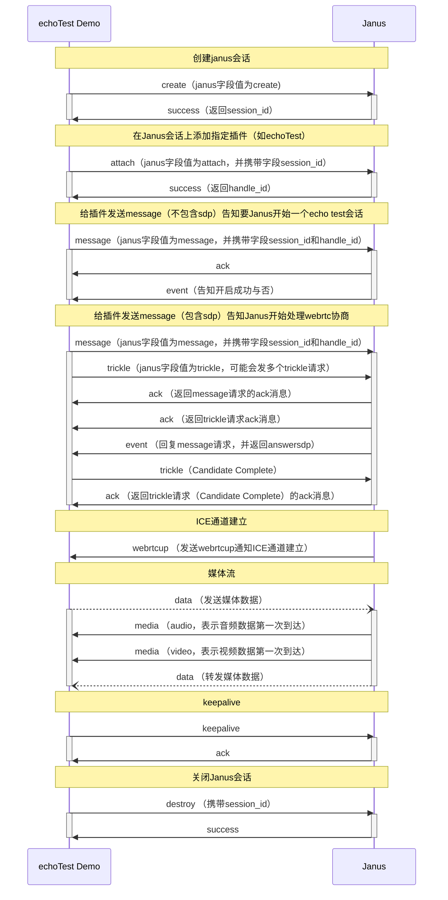

## echoTest demo工作流程

### 1. 初始化连接

- 设置好要连接的janus相关地址

### 2.访问janus，创建session
- 点击echoTest demo的start按键，触发echoTest.js脚本
- 在echoTest.js中，创建一个新的Janus实例（janus = new Janus(...)），并传入回调函数
- 在Janus构造函数中，调用createSession方法，并传入gatewayCallbacks回调

### 3.创建WebSocket连接

- createSession方法创建WebSocket连接到Janus服务器：`ws = Janus.newWebSocket(server, 'janus-protocol')`。
- 设置WebSocket的相关回调函数：`error`、`open`、`message` 和 `close`

### 4.处理WebSocket事件

- 连接成功后将执行open的回调，发送创建session的请求到Janus服务器
- Janus服务器响应该请求后返回一个json触发`transactions.set(transaction, function (json) {})`回调，设置心跳`wsKeepaliveTimeoutId`保持WebSocket连接活跃并保存`sessionId`，随后回调echoTest.js的success
- 在echoTest.js的success回调中，使用`sessionId`添加echoTest插件。

### 5.添加echoTest插件

- 触发Janus实例的attach方法，传入`sessionId`和相关回调，用于添加echoTest插件
- 成功添加插件后，Janus服务器会返回一个`handleId`，并通过echoTest.js的success回调接收
- 在回调中，获取pluginHandle对象，它包含了与echoTest插件交互的方法，如createOffer等

### 6.配置WebRTC

- 调用pluginHandle的send方法，发送音视频配置消息给Janus服务器

- 调用pluginHandle的createOffer方法创建Offer SDP

- 在createOffer过程中，触发prepareWebrtc方法，在该方法中初始化PeerConnection，并添加相应回调同时设置ICE
  
  - 设置ICE
    ```
    let pc_config = {
        iceServers: iceServers, // 这里设置 ICE 服务器
        iceTransportPolicy: iceTransportPolicy, // 这里设置 ICE 传输策略
        bundlePolicy: bundlePolicy // 这里设置捆绑策略
    };
    pc_config.sdpSemantics = 'unified-plan'; // 设置 SDP 语义

   - 回调
  
        ```
       - config.pc.onconnectionstatechange = function ()
         - 在`RTCPeerConnection`的连接状态发生变化时触发
       - config.pc.oniceconnectionstatechange = function ()
         - 在ICE候选收集状态发生变化时触发
       - config.pc.onicecandidate = function (event)
         - 在本地ICE代理发现新的ICE候选时触发
       - config.pc.ontrack = function (event)
         - 在远程媒体流中的新轨道（track）被接收时触发
       ```


### 7.处理SDP和ICE候选

- PeerConnection初始化完成后，prepareWebrtc函数再调用createOffer方法生成offersdp并设置本地描述`setLocalDescription`

- 设置完成后返回offersdp并通过echoTest.js的success回调接收

- 使用pluginHandle的send方法，将本地生成的Offer SDP发送给Janus服务器

- Janus服务器处理SDP，并返回一个Answer SDP，并触发echoTest.js的onMessage回调

  ```
  				let callback = pluginHandle.onmessage;
  				if (callback) {
  					Janus.debug("Notifying application...");
  					// Send to callback specified when attaching plugin handle
  					callback(data, jsep);
  				} else {
  					// Send to generic callback (?)
  					Janus.debug("No provided notification callback");
  				}
  ```

- 在echoTest.js的onMessage回调中，触发pluginHandle的handleRemoteJsep并调用prepareWebrtcPeer

- 在prepareWebrtcPeer中设置远端描述

### 8. 监控
- 监控PeerConnection的状态，使用prepareWebrtc初始peerconnection中设置的回调函数

### 9. 结束
- 点击stop结束测试，触发janus的destroy清空相应资源并断开janus连接

### 10.websocket连接交互流程
